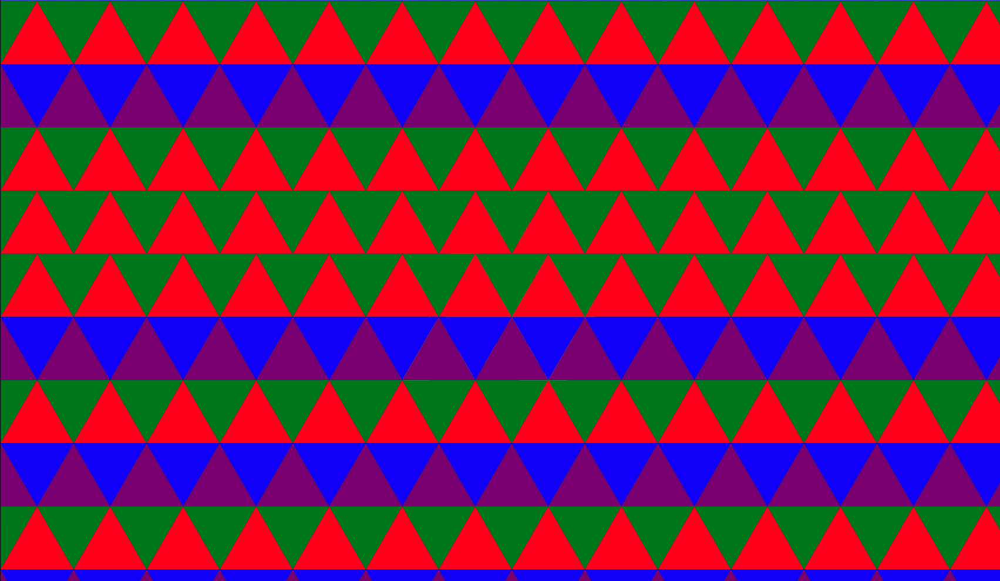
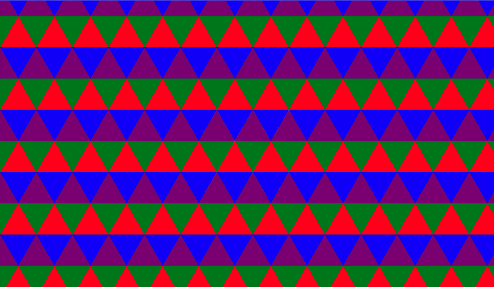

# Tessellated Grid

This repository replicates the power-up screns on Blazblue Entropy Effect

Demo: https://tessellated-ui.vercel.app/

<div align="center">
  
</div>

# Technical Solution

## Triangle Position

We use the `window.innerWidth` and `window.innerHeight` to calculate the "canvas" size.

This will also determine the `triangleSize` and therefore the triangle height (`h`).

The layout is defined by the `triangles` array that loops over the `width` and `height`. The step which we iterates is crucial for both axis.

On the Y axis, we start with `-h / 2` and increment by `y += h`. This is fundamental to ensure that rows of triangles align perfectly both vertically and horizontally when we run the `const isUpwards = Math.floor(y / h) % 2 === 0` condition.

Each upward triangle in a row is meant to interlock with a downward triangle in the next row. Starting at `-h / 2` centers the first pair (upward + downward) around `y = 0`, allowing the tessellation to alternate cleanly.

Initially, I tried starting at `-h` or `0`, but this caused subtle misalignments — not because the triangle geometry was wrong, but because I was unintentionally offsetting the even/odd row parity, which determines how triangles are horizontally arranged. This led to a horizontal shift between rows because the parity changed which triangle layout was applied to each row.

Using debug colors for each triangle, we can easily see what is happening.

For `y = -h` or `y = 0`:

<div align="center">
  
</div>

For three rows, we repeat the `isUpward` condition, rendering the red triangles.

For `y = -h / 2`:

<div align="center">
  
</div>

We beautifully intercalate and align between upward triangles in a row (red) and downward triangles in the next row (blue)

On the X axis, we simply start by offsetting by the triangle size. This will give a sense of continuity since there will be cropped triangles from the left to the right. If I started on `x = 0`, I would have a blank space in the left size of the screen.

> [!WARNING]  
> There are rendered triangles outside the view. I don't know how they are affecting perfomance.

## Triangle Color

The `getTriangleColor(index: number, t: number)` is responsible for defining the color and returning the final color in HSLA format.

Over time, this function generates a softly animated, semi-transparent color for each triangle based on the `index`. The goal is a natural flickering effect, where most of the triangles will be transparent to reflect the background color

Since the index is predictable we add some randomess to avoid patterns in the grid:

```ts
const seed = (index * 0.61803398875) % 1;
```

Using the sin function, we can define an oscilator. This will give each triangle an animated behavior over time:

```ts
const wave = Math.sin(t * freq + phase);
```

- `phase`: it defines the **starting offset**. We do it keep the triangles out of sync:

```ts
const phase = seed * Math.PI * 3;
```

- `freq`: define the **oscillation speed**:

```ts
const freq = 0.5 + seed * 1;
```

With the wave defined, we can define the HSLA color:

- `hue = 220 + Math.sin(phase * 3) * 15`: we define here a bluish color with small variation
- `lightness = 50 + wave * 5`: this will keep the lightness between 45% and 55%, also contributing for variation in the perceived color
- `saturation`: this is hard-coded to 100%
- `alpha = Math.max(0, wave) * 0.25`: by only using the **positive side** of the sine wave, we generate a **pulse effect**. This generates a pulse effect, minimal and organic motion

---

For the timing system, we use `requestAnimationFrame` the `perfomance.now()`:

```ts
useEffect(() => {
  const start = performance.now();
  const animate = (now: number) => {
    const t = (now - start) / 1000; // seconds
    setTime(t);
    rafRef.current = requestAnimationFrame(animate);
  };
  rafRef.current = requestAnimationFrame(animate);
  return () => cancelAnimationFrame(rafRef.current!);
}, []);
```

`perfomance.now()` returns a precise timestamp in milliseconds and defines when the animation starts. This starting point will allows us to trigger the elapsed time every time `requestAnimationFrame` is called.

`requestAnimationFrame` is called in sync with the browser’s refresh cycle. Each time it executes, it passes a `now: DOMHighResTimeStamp` to the `animate` function. This `now` represents the current high-resolution time when the frame is being rendered

By subtracting our original `start` timestamp from `now`, we get the accurate elapsed time since the animation began. When we call `setTime(t), `we update the animation in a way that stays perfectly in sync with the screen refresh, making it smooth and consistent.

# Canvas Implementation

I have asked GPT to improve the perfomance and it suggested using `<canvas>`. I will leave the code on `./src/CanvasApp.tsx`, but I won't be digging deeper on it for now
